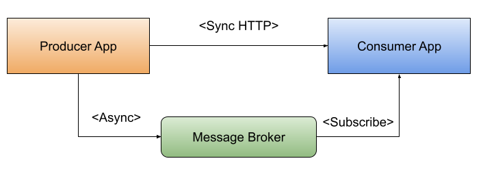
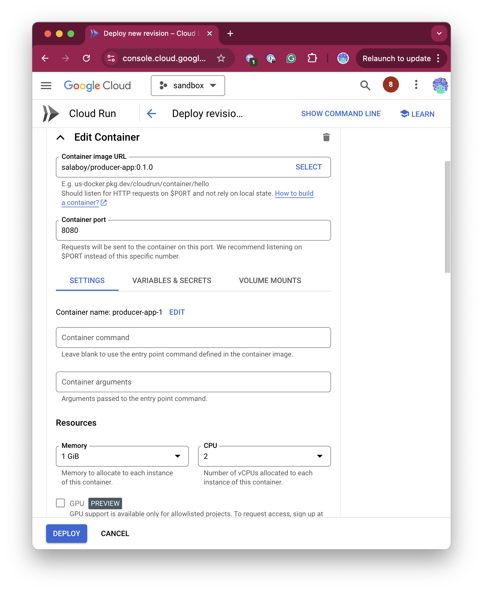

# KubeCon NA 2024 - Salt Lake City Examples

In this repository you can find two simple applications: 
- Producer App: this app create two types of requests. Synchrnous HTTP requests to the consumer app and asyncronous requests using a message broker. 
- Consumer App: exposes endpoints to receive HTTP requests and consume async messages from a a message broker. 



We wanted to demonstrate how easy (and difficult) it could be to create, manage and operate these two simple projects that implement these two extremely frequent services interaction patterns. 

How can we achieve this while we guarantee that our services are resilient and scalable? Let's find out. 


## Build and package

To create the application containers run: 

```bash
mvn clean spring-boot:build-image
docker tag 
docker push
```

Images are pushed to:
- docker.io/salaboy/producer-app:0.1.0
- docker.io/salaboy/consumer-app:0.1.0

### Run Locally

You can run both services locally for local development tasks: 

```
mvn spring-boot:test-run
```

## Deploy 

We will use a KinD cluster to deploy the application locally to a Kubernetes Cluster.

```bash
kind create cluster
```

The application uses RabbitMQ as a message broker to send async messages between the producer and the consumer app. Let's install RabbitMQ using Helm: 

```bash
helm repo add bitnami https://charts.bitnami.com/bitnami
helm repo update
helm install rabbitmq oci://registry-1.docker.io/bitnamicharts/rabbitmq
```

We will be using [Dapr](https://dapr.io) to make our application resilient and portable across environments. Let's install Dapr using Helm in our cluster:

```bash
helm repo add dapr https://dapr.github.io/helm-charts/
helm repo update
helm upgrade --install dapr dapr/dapr \
--version=1.14.1 \
--namespace dapr-system \
--create-namespace \
--wait
```

Then we deploy both applications by running: 

```bash
kubectl apply -f k8s/
```

This deploys both applications plus three important Dapr resources: 
1. A PubSub Component that enable applications to publish and subscribe to messages/events by interacting with the Dapr PubSub APIs. This PubSub Component has all the information needed to connect to our RabbitMQ instance that we installed using Helm.
1. A PubSub subscription that declaratively defines that the consumer-app is interested in all messages published to the PubSub component that we defined in the previous step. 
1. A Resiliency Policy Configuration that enable circuit breaker and retry policies for our service to service invocations. 


First expose the producer-app to be able to send a requests: 

```bash
kubectl port-forward svc/producer-app 8080:8080
```

Then to send Events between the applications send the following request: 

```bash
http :8080/device/events id="asd-123" device="device1" payload=content="abc"
```

You should see in the `consumer-app` logs: 

```bash
kubectl get logs -f <POD_ID>

....

CONSUME +++++ io.dapr.client.domain.CloudEvent@a72bcf5c
DATA +++++ DeviceEvent{id='asd-123', device='device1', payload=Payload{content='content=abc'}}
```


```bash
http :8080/device/info id="123" content="abc"
```

You should be able to see the content field being decorated with `-validated`:

```bash
HTTP/1.1 200 
Connection: keep-alive
Content-Type: application/json
Date: Tue, 17 Sep 2024 11:55:44 GMT
Keep-Alive: timeout=60
Transfer-Encoding: chunked

{
    "content": "abc-validated",
    "id": "123"
}
```

If you want to leverage all the Dapr functionalities you can try [Conductor]() to monitor your applications running in Kubernetes. 


# Working in the Cloud with GCP Cloud Run

You can run the same application in the Cloud, no Kubernetes needed. You can use any container as a service platform to run the same applications without any code change.

In GCP Cloud Run you can deploy both applications (`producer-app` and `consumer-app`) as containers by configuring the following parameters: 

```
Container Image URL: salaboy/producer-app:0.1.0
```



```
Container Image URL: salaboy/consumer-app:0.1.0
```


For this two applications to work in this setup, we will need a message broker and a way to add  resiliency policies to work across both applications.

If we want to avoid changing the applicaations code, we will need some sort of Dapr for Cloud Run. 


## References

- AppDeveloperCon 2024: 
- KubeCon NA 2024: https://sched.co/1i7kY
